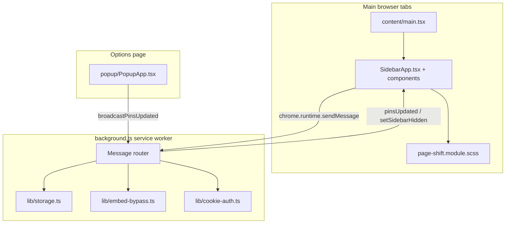

# browser-sidebar — Implementation Guide

This document describes how the extension works so a new agent session can understand the repo without re-discovering behavior from scratch.

## Purpose

browser-sidebar is a **Chrome Manifest V3 extension** that brings a native-style sidebar to normal web pages. It is **not** native browser chrome — it injects UI into page viewports and shifts page content with CSS margins.

**Primary UX:**
1. A fixed **48px icon strip** on the left of every `http(s)` page (hideable via toolbar icon).
2. An expandable **in-page panel** (300–1000px) that loads pinned sites in an `<iframe>`. The panel is tried **first for every pin** — the background service worker strips iframe-blocking response headers (`X-Frame-Options`, CSP `frame-ancestors`) for pinned domains via `declarativeNetRequest`. See **Embed bypass** below for the full layered strategy.
3. If a site still can't render in the panel (rare — app-level JS/OAuth anti-framing checks that don't rely on headers), the runtime iframe-verification layer detects the failure and the panel shows an **in-panel fallback view** (pin icon, pin name, "This site could not load in the panel.") with an **Open in new tab** button.
4. **Inline settings** (gear icon) to add/edit/remove/reorder pins, adjust panel width, and reset to defaults.

---

## Architecture



**Stack:** TypeScript, React 19, SCSS modules, Vite + `@crxjs/vite-plugin`. Content script mounts a React tree inside a closed Shadow DOM.

### Why not a native sidebar?

Native browser sidebars render sidebar apps in **real top-level browsing contexts**, which are never subject to `X-Frame-Options` / CSP `frame-ancestors` — those headers only govern embedding inside an `<iframe>`. Chrome extensions can only:
- Inject into pages (`content_scripts`)
- Open tabs/windows (`chrome.tabs`, `chrome.windows`)
- Rewrite network response headers for requests they have host permission for (`declarativeNetRequest`)

There's no extension API to create a real top-level browsing context docked beside the page the way native browser sidebars do, so this extension uses an `<iframe>` inside the injected sidebar. Sites like X, Instagram, and Discord send `X-Frame-Options` / CSP `frame-ancestors` headers specifically to block that kind of iframe embedding.

**The fix (`lib/embed-bypass.ts`):** since the extension already has `<all_urls>` host permission, it uses `declarativeNetRequest` to strip those response headers for `sub_frame` requests to pinned domains before they reach the renderer. The remaining gap: a handful of sites (mainly OAuth/sign-in flows) also refuse framing via JavaScript or server-side checks unrelated to response headers — those show the in-panel fallback view with an "Open in new tab" button.

---

## File map

| Path | Role |
|------|------|
| `manifest.json` | MV3 config; `@crxjs/vite-plugin` builds to `dist/` |
| `src/background.ts` | Service worker: messaging hub, embed-bypass rule sync, cookie relax + watcher, session panel-state broadcast, sidebar hide toggle |
| `src/content/main.tsx` | Entry: bootstrap, shadow DOM mount, React root |
| `src/content/SidebarApp.tsx` | Main UI state: pins, panel, iframe verification, settings |
| `src/content/components/IconStrip.tsx` | Pin buttons + gear |
| `src/content/components/AppPanel.tsx` | Iframe panel, loading/fallback views, resize handle |
| `src/content/components/SettingsPanel.tsx` | Inline settings UI |
| `src/content/sidebarUtils.ts` | Page-shift injection, layout classes, storage load |
| `src/content/keyboardIsolation.ts` | Prevents host-page shortcuts from swallowing sidebar input |
| `src/content/sidebar.module.scss` | Shadow DOM styles (dark theme) |
| `src/content/page-shift.module.scss` | Shifts `html` margin when strip/panel open |
| `src/lib/defaults.ts` | Constants, default pins |
| `src/lib/storage.ts` | `chrome.storage.sync` read/write helpers |
| `src/lib/embed-bypass.ts` | Syncs two `declarativeNetRequest` session rules: response-header stripping + `CORP: cross-origin` (rule 1) and `Sec-Fetch-*` spoofing (rule 2), for `sub_frame` requests to pinned domains |
| `src/lib/cookie-auth.ts` | Re-writes pinned-site cookies to `sameSite: 'no_restriction'` + `cookies.onChanged` watcher so panel iframes reuse existing sessions |
| `src/lib/pin-utils.ts` | Icon URL resolution, URL parsing, pin reindexing, `getCurrentPagePinDefaults()` |
| `src/lib/types.ts` | Shared TypeScript interfaces |
| `src/popup/*` | Full-page options UI (`options_ui`); mirrors inline settings |
| `icons/apps/*` | Default pin SVG icons |

**Build:** `npm run build` → `dist/`. Load unpacked from `dist/`.

---

## Permissions

```json
["storage", "scripting", "tabs", "windows", "cookies", "declarativeNetRequestWithHostAccess"]
```

- `storage` — pins/settings in `chrome.storage.sync`; panel open state (`browserSidebarPanelOpen`, `browserSidebarPanelPinId`) in `chrome.storage.session`
- `scripting` — fallback inject when toolbar click hits a tab without content script
- `tabs` — `openTab` message (open a pin's URL in a new tab); sidebar hide broadcast
- `cookies` — re-writes pinned-site cookies with `sameSite: 'no_restriction'` so panel iframes reuse existing sessions (`lib/cookie-auth.ts`)
- `declarativeNetRequestWithHostAccess` — lets the background worker strip `X-Frame-Options` / CSP response headers and rewrite `Sec-Fetch-*` request headers for pinned domains (`lib/embed-bypass.ts`); requires the existing `<all_urls>` host permission
- `host_permissions: ["<all_urls>"]` — content scripts on all normal pages; also backs the header-stripping rule above

---

## Data model

### Pin (stored in `chrome.storage.sync`)

```ts
{
  id: string,        // e.g. "discord" or "custom-1734567890"
  name: string,
  url: string,       // full https URL
  iconUrl: string,   // extension-relative ("icons/apps/x.svg") or absolute http(s)
  order: number      // strip sort order
}
```

### Settings

```ts
{
  panelWidth: 600,
  theme: 'dark'
}
```

### Storage keys

| Key | Location | Purpose |
|-----|----------|---------|
| `pins` | sync | Ordered list of pins |
| `settings` | sync | Panel width, theme |
| `lastActivePinId` | sync | Last clicked pin |
| `sidebarHidden` | sync | Whether icon strip is hidden on all pages |
| `browserSidebarPanelOpen` | session | Whether the in-page panel is open |
| `browserSidebarPanelPinId` | session | Active pin shown in the panel |

### Defaults

Defined in `src/lib/defaults.ts`:
- `BROWSER_SIDEBAR_DEFAULTS.DEFAULT_PINS` — 7 default apps (Messenger, Instagram, X, YouTube, YouTube Music, ChatGPT, Claude)
- `BROWSER_SIDEBAR_DEFAULTS.PANEL_MIN_WIDTH` / `PANEL_MAX_WIDTH` / `PANEL_WIDTH` — 300 / 1000 / 600px panel sizing limits
- `BROWSER_SIDEBAR_DEFAULTS.IFRAME_LOAD_TIMEOUT_MS` — 15000ms embed-failure net

---

## UI structure (content script)

Injected once per top-level frame into `#browser-sidebar-host` with **closed Shadow DOM**. React renders inside the shadow root.

```
.sidebar-root
├── IconStrip            ← pin buttons + gear (settings)
├── AppPanel             ← iframe panel (opens with .open)
│   ├── .panel-header
│   └── .panel-body (iframe | loading | fallback)
└── SettingsPanel        ← inline settings (opens with .open)
    └── pinned list, pin current page, add/edit form, width, reset
```

**Page margin** (`page-shift.module.scss`, applied via `applyLayoutClasses()` in `sidebarUtils.ts`):
- `html.browser-sidebar-strip-visible` → `margin-left: 48px`
- `html.browser-sidebar-open` → `margin-left: 48px + panelWidth`
- `html.browser-sidebar-hidden` → `margin-left: 0` (strip hidden via toolbar)

CSS variables `--browser-sidebar-strip-width` and `--browser-sidebar-panel-width` are set on `document.documentElement` by `setCssVariables()`.

### Panel resize (live width gestures)

The panel width is changed two ways: dragging the `.resize-handle` on the panel's right edge, or the width slider in settings. Both gestures share one architecture designed to keep the embedded site stable while the panel resizes.

**Pointer capture, not document listeners.** The handle's `onPointerDown` starts the drag and calls `setPointerCapture` on the handle element; `pointermove` / `pointerup` / `pointercancel` are attached to the handle, not `document`. Cross-origin iframes swallow document-level `mousemove` events, and pointer capture keeps delivering events even when the cursor leaves the window mid-drag.

**Iframe width-lock.** During any resize gesture (handle drag OR slider), the iframe is frozen at its pre-gesture width via inline `style.width` (clipped by the panel's `overflow: hidden`), and `.sidebar-root.resizing .panel-iframe { pointer-events: none }` stops the embed from eating input. The embed reflows **exactly once, on release** — per-frame iframe reflow is what made heavy embeds (chatgpt.com) jank and crash. On release the inline width is cleared so the frame snaps to the committed panel size.

**CSS variable only during the gesture.** Live width updates never touch React state: they write the `--browser-sidebar-panel-width` CSS variable imperatively through a single `requestAnimationFrame` throttle (`sliderFrameRef` / `sliderWidthRef` for the slider path, a local `frame` ref for the drag path), so the sidebar tree — including the embed iframe — does not re-render on every pointer event. React state and `chrome.storage.sync` commit once at gesture end (`onPanelWidthCommit` / drag `onEnd`).

**Page tracking.** `.resize-handle` has `touch-action: none` (pointer events instead of touch scrolling), `.app-panel` has `contain: layout paint` (cheap layout containment during the gesture), and the host page gets the `browser-sidebar-resizing` class for the duration, which disables the `margin-left 0.2s` transition so the shifted page tracks the cursor 1:1 instead of rubber-banding.

### Keyboard isolation

`keyboardIsolation.ts` stops host-page keyboard shortcuts from intercepting input inside sidebar form fields (settings add/edit form).

---

## Core user flows

### 1. Click a pin (`handlePinClick` in `SidebarApp.tsx`)

```
Click pin
  → close settings if open
  → if same pin + panel open → closePanel() (toggles the panel closed, clears the pin)
  → set activePinId, save last active pin
  → setPanelOpen(true), openPanelForPin(pin)   ← always try the panel first
```

**Design goal (native-sidebar parity):** the in-page panel opens for *every* pin. `lib/embed-bypass.ts` strips blocking response headers for pinned domains in the background, so the iframe attempt is expected to succeed for the vast majority of sites. Only a genuine runtime failure shows the in-panel fallback view.

### 2. Open panel (`openPanelForPin`)

Called directly on every pin click — no preflight gate.

1. Reset embed-failure guards (`embedFailureHandled`, `embedFailureInFlight`, verify generation).
2. Show loading spinner and set `iframe.src = pin.url`.
3. Start **15s timeout** (`IFRAME_LOAD_TIMEOUT_MS`) → `handleEmbedFailure` if load/verification still failing (runtime fallback).
4. On iframe `load` → `startIframeVerification`.

### 3. Settings (gear icon)

Opens `SettingsPanel` (same width as app panel). Closes app panel when opened.

Features:
- **Pin current page** — preview card with one-click add or “Edit before adding” (uses `getCurrentPagePinDefaults()` for title, URL, favicon)
- **+ Add website** — scrolls to add form and pre-fills current page
- Add or **edit** pin manually: name, URL, optional icon URL
- List pins with delete
- **Drag-and-drop reorder** (HTML5 DnD, updates `order`, calls `saveAndBroadcast`)
- Panel width slider
- Reset to defaults

Icon strip footer has **gear (settings) only** — no separate “+” button on the strip.

`saveAndBroadcast()` writes to `chrome.storage.sync` and sends `broadcastPinsUpdated` → all tabs re-render strip; the background also re-syncs embed-bypass rules.

### 4. Toolbar icon click (`background.ts`)

Toggles `sidebarHidden` in sync storage and broadcasts `setSidebarHidden` to all tabs. On failure (content script not loaded), fallback `executeScript` injects the content script.

**Guard:** `isInjectableUrl()` — skips `chrome://`, `about:`, etc.

---

## Embed bypass — how sites that normally block iframes are made to work

The sidebar panel embeds pinned sites in a **cross-origin iframe** inside the page — exactly the context many sites actively block. Getting those sites to load is a layered strategy; each layer targets a different kind of block.

### Layer 1 — DNR response-header stripping (`lib/embed-bypass.ts`, rule ID 1)

Sites block embedding with response headers. Chrome enforces them before any page script runs, so they must be stripped from the actual response. The rule strips:
- `X-Frame-Options` (`DENY` / `SAMEORIGIN`)
- CSP `frame-ancestors`, delivered via `Content-Security-Policy`, `Content-Security-Policy-Report-Only`, or legacy `X-Content-Security-Policy`
- `Cross-Origin-Embedder-Policy` (COEP) — stripped so the embedded app's own subresources are not restricted by the response's COEP requirements

Because the extension has `<all_urls>` host permission, a `declarativeNetRequest` **session rule** (fixed ID 1) rewrites `sub_frame` responses for pinned domains. The rule also **sets `Cross-Origin-Resource-Policy: cross-origin`** on the response. That injection is required when the host page enforces COEP `require-corp`: otherwise the iframe load is blocked by the host's COEP policy even with every blocking header already stripped.

### Layer 2 — Fetch-metadata spoofing (`lib/embed-bypass.ts`, rule ID 2)

Some sites detect framing server-side via Fetch Metadata request headers. Meta (messenger.com) is the canonical case: it answers any request carrying `Sec-Fetch-Dest: iframe` with a generic "Your Request Couldn't be Processed" error page (error 1357005).

Rule 2 rewrites `sub_frame` request headers for pinned domains so the navigation looks like a user-typed top-level visit:
- `Sec-Fetch-Dest: document`
- `Sec-Fetch-Mode: navigate`
- `Sec-Fetch-Site: none`
- `Sec-Fetch-User: ?1`
- `Referer` removed

Together these match a typed address-bar navigation exactly, so the request carries no sign of being embedded. DNR can set or remove `Sec-Fetch-*` headers but cannot append to them; the "document / navigate / none / ?1 + no Referer" set is the proven production pattern.

Rule 2 is committed in a **separate `updateSessionRules` call** from rule 1 on purpose: if Chrome ever rejects the Sec-Fetch rewrite, the header-strip rule still applies. Both rules are synced by `browserSidebarSyncEmbedBypassRules` at `onInstalled`, `onStartup`, `broadcastPinsUpdated` (pin/settings changes), and `resetStorage`.

### Layer 3 — Cookie/session reuse (`lib/cookie-auth.ts`)

The panel iframe is a third-party context: it lives on whatever page the user is browsing, so its requests are cross-site. Chrome does not attach `SameSite=Lax` / `SameSite=Strict` (or unspecified) cookies to cross-site sub-frame requests — signed-in sites like claude.ai would show a login page in the panel even though the browser already holds a valid session.

The `cookies` permission lets the extension re-write pinned-site cookies with `sameSite: 'no_restriction'` via the `chrome.cookies` API (the cookie jar is shared browser-wide, so the iframe reuses the exact session from normal tabs):
- `browserSidebarRelaxPinnedSiteCookies()` — runs at `onInstalled` / `onStartup` / `broadcastPinsUpdated` / `resetStorage`; flips every Secure pinned-domain cookie to `no_restriction` (`no_restriction` requires the Secure attribute).
- `browserSidebarWatchPinnedSiteCookies()` — a top-level `cookies.onChanged` watcher, registered synchronously at worker top level so it survives service-worker wakes. It re-flips cookies when sites re-issue them with restrictive SameSite values (login refreshes, session rotation). Our own re-writes already carry `no_restriction` and are filtered out, so the watcher cannot loop.

### Layer 4 — Runtime verification + graceful failure (`SidebarApp.tsx`)

Even with headers and cookies handled, some sites refuse framing from inside page code (JS frame-busting, app-level checks). The content script detects the failure instead of leaving a dead frame on screen.

Each navigation remounts a **fresh iframe** (`key={frameEpoch}`, controlled `src` prop; `''` parks the frame on `about:blank`). Reusing one frame across cross-origin pins was flaky; a pristine frame per navigation is deterministic and skips the reset round-trip.

Verification pipeline:
- **15s `IFRAME_LOAD_TIMEOUT_MS`** — the only failure net. If load/verification has not succeeded by then, `handleEmbedFailure` fires.
- **250ms about:blank stall poll** — a load event while the frame is still on `about:blank` means the navigation is mid-commit (heavy sites like chatgpt.com can take seconds to commit) or permanently blocked. The poll never fails on its own: a real commit flips the href, a pin change cancels via the generation bump, and the 15s timeout declares genuine failure. Failing fast from here used to misclassify slow-but-healthy embeds as blocked.
- **Strict error-page matching** — an embed counts as blocked only when the frame's location is `chrome-error:`, OR its body `innerText` is **≤250 chars** (`IFRAME_ERROR_PAGE_MAX_TEXT_LENGTH`) AND matches `EMBED_BLOCKED_PATTERN`. Live site content or inline scripts that happen to mention phrases like "failed to load" can never false-positive.
- **Post-success watchdog** — after a successful load, a **4s window at a 500ms interval** keeps checking. Some blocked embeds commit an error page late, after the load event was already treated as success; the watchdog catches that and shows the fallback view instead of leaving a dead frame on screen.

A genuine failure lands on the **in-panel fallback view**: pin icon, pin name, "This site could not load in the panel.", and an **Open in new tab** button that sends the `openTab` message to the background (`chrome.tabs.create`). No window ever opens automatically.

### Known limits

- **JS frame-busting / app-level checks** (mainly OAuth sign-in flows like Google/Microsoft) can't be fixed by header rewriting — the site detects the embedded context from inside its own scripts. These are exactly the sites that reach the fallback view.
- **Blocking third-party cookies in Chrome settings** breaks iframe cookies regardless of SameSite rewriting.
- **Storage partitioning still applies** — localStorage/IndexedDB inside the third-party iframe stays partitioned; cookie-auth only restores cookie-based sessions.

---

## Message protocol

| Action | Direction | Handler | Purpose |
|--------|-----------|---------|---------|
| `saveLastActivePin` | content → background | `storage.ts` | Persist active pin id |
| `broadcastPinsUpdated` | popup/settings → background | `background.ts` | Sync pins to all tabs + re-sync embed-bypass rules + relax pinned-site cookies |
| `pinsUpdated` | background → content | `SidebarApp.tsx` | Re-render strip/settings |
| `setSidebarHidden` | background → content | `SidebarApp.tsx` | Show/hide icon strip |
| `panelStateSynced` | background → content | `SidebarApp.tsx` | Mirror panel open/close (from session storage) to all tabs |
| `getStorageData` | popup → background | `storage.ts` | Load pins/settings |
| `resetStorage` | popup/settings → background | `storage.ts` | Restore defaults + re-sync embed-bypass rules + relax pinned-site cookies |
| `togglePanel` | background → content | `SidebarApp.tsx` | Legacy: open/close active panel |
| `getState` | popup → content | `SidebarApp.tsx` | Return panel/sidebar state |
| `openTab` | content → background | `background.ts` | Open URL in new tab |

All async handlers return `true` from `onMessage` and call `sendResponse` in a promise/IIFE.

---

## Key modules reference

### `content/SidebarApp.tsx`

| Concern | Purpose |
|---------|---------|
| `handlePinClick` | Always opens the in-page panel for the clicked pin |
| `openPanelForPin` | Load the iframe (or show the fallback view on failure) |
| `verifyIframeEmbed` | Poll-based runtime embed detection (safety net after header bypass) |
| `finalizeIframeSuccess` | Confirms pin/generation are current, then shows the iframe |
| `handleEmbedFailure` | Show in-panel fallback view (icon, pin name, "Open in new tab") |
| `quickPinCurrentPage` | One-click add of current page tab |
| `showIframeLoaded` | Success path |
| `saveAndBroadcast` | Persist + sync all tabs |
| Message listener | Handles `pinsUpdated`, `setSidebarHidden`, etc. |

### `content/sidebarUtils.ts`

| Function | Purpose |
|----------|---------|
| `loadSidebarStorage()` | Initial pins/settings/hidden state |
| `applyLayoutClasses()` | Toggle `html` margin classes |
| `setCssVariables()` | Set `--browser-sidebar-strip-width`, `--browser-sidebar-panel-width` |
| `setPanelWidthCss()` | Live width update during drag/slider: writes `--browser-sidebar-panel-width` imperatively (no React state) |
| `setPageResizeActive()` | Toggle `browser-sidebar-resizing` on host page (disables the margin transition mid-gesture) |
| `injectPageShiftStyles()` | Inject global page-shift CSS once |

### `lib/embed-bypass.ts`

| Function | Purpose |
|----------|---------|
| `browserSidebarSyncEmbedBypassRules()` | Recomputes pin hostnames and replaces the two `declarativeNetRequest` session rules — header-strip + `CORP: cross-origin` (rule 1) and `Sec-Fetch-*` spoof (rule 2) — each in its own `updateSessionRules` call |

### `background.ts`

| Function | Purpose |
|----------|---------|
| `broadcastToAllTabs()` | Send message to all injectable tabs |
| `isInjectableUrl()` | http/https check |

---

## Concurrency and race conditions (important for debugging)

| Problem | Mitigation |
|---------|------------|
| Multiple `handleEmbedFailure` calls | `embedFailureHandled`, `embedFailureInFlight` |
| Stale iframe verify timers | `iframeVerifyGeneration` incremented on each new load |
| Cross-origin opaque frame mistaken for failure | `location.href` throwing is treated as success (expected for cross-origin load) |
| Edited pin's embed-bypass rule not synced yet | `handleSavePin` reloads panel only after `await saveAndBroadcast(...)` resolves |
| Runtime embed failure after header bypass | `handleEmbedFailure` (timeout/onerror/pattern match) shows the in-panel fallback view |

---

## Platform limitations (do not try to “fix” without architectural change)

1. **A handful of sites still can't be embedded** (mainly OAuth/sign-in flows) — they detect framing via JavaScript or server-side checks, not just response headers. These show the in-panel fallback view with an "Open in new tab" button.
2. **Cannot add real sidebar to browser chrome** — extension API limit.
3. **Content scripts don't run on `chrome://` pages** — toolbar toggle guarded.
4. **`chrome.storage.sync` merge** — existing users keep old pins until reset; new default pins only apply on first install or reset.
5. **Third-party cookie/session quirks** — the iframe is a third-party context; some sites may repeatedly ask to log in even once framing succeeds.

---

## Testing notes

| Pin | Expected behavior |
|-----|-------------------|
| **Example** (`example.com`) | Panel opens with iframe |
| **Twitch / Discord / X / Instagram / ChatGPT / Claude** | Panel opens and loads iframe — embed-bypass strips blocking headers. Verify via service worker console that `browserSidebarSyncEmbedBypassRules` ran. |
| OAuth/sign-in pages (e.g. `accounts.google.com`) | Panel opens, then shows the in-panel fallback view after runtime detection — expected |
| Click same pin (panel open) | Panel closes, pin deselected |
| Fallback view "Open in new tab" | Sends `openTab` → `background.ts` → `chrome.tabs.create` opens the pin's URL |
| **Settings → Pin current page** | Adds current tab URL/title/favicon to strip |
| Toolbar click | Hides/shows strip; page margin resets when hidden |

Reload extension after manifest/permission changes at `chrome://extensions`.

Service worker logs: click **Service worker** link on extension card. Look for `[browser-sidebar]` prefixed messages.

---

## Extending the codebase

### Add a default pin

Edit `BROWSER_SIDEBAR_DEFAULTS.DEFAULT_PINS` in `src/lib/defaults.ts` and add icon under `icons/apps/`. Existing installs need **Reset to defaults** in settings.

### Add more headers to the bypass

Edit `HEADERS_TO_STRIP` in `src/lib/embed-bypass.ts` if a site uses another header to block framing. Keep the list conservative.

### Debug a site that fails to embed in the panel

1. DevTools → Network → filter by pin domain → check whether `X-Frame-Options` / CSP are gone on the sub-frame document request. If still present, check service worker console for `browserSidebarSyncEmbedBypassRules` errors.
2. If headers are gone but the panel still shows the fallback view, the site is doing JS/server-side anti-framing — the in-panel fallback view with "Open in new tab" is the expected outcome.
3. If the fallback view appears instantly, check `EMBED_BLOCKED_PATTERN` in `SidebarApp.tsx` isn't matching non-error page text (false positive).

### Add new message action

1. Handle in `background.ts` `onMessage` (return `true` if async).
2. Call from `SidebarApp.tsx` via `chrome.runtime.sendMessage`, or listen in the content script message handler.
3. Document in this file’s message protocol table.

---

## Related docs

- `README.md` — user-facing install/usage
- `src/popup/` — full-page options UI; inline settings (`SettingsPanel`) is the primary in-page UX

---

*Last updated to reflect: four-layer embed bypass — DNR response-header strip + `CORP` injection and `Sec-Fetch-*` spoofing (`lib/embed-bypass.ts`), cookie SameSite relaxation (`lib/cookie-auth.ts`), and runtime verification with the in-panel fallback view — plus the pointer-capture panel-resize architecture. The companion popup window has been removed.*
